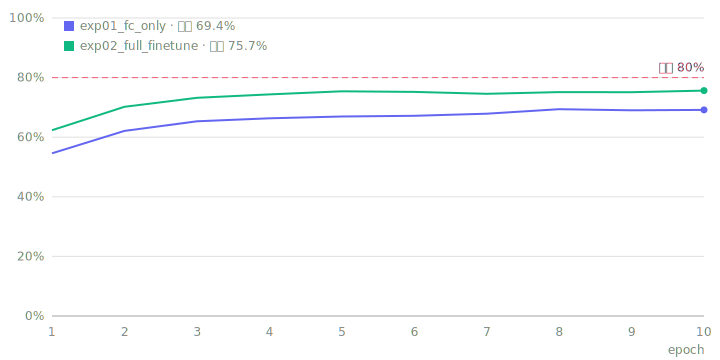

# Deep Learning Study — Stanford 40 Actions

ResNet18 파인튜닝으로 [Stanford 40 Actions](http://vision.stanford.edu/Datasets/40actions.html)
(사람 행동 40클래스 분류) **테스트 정확도 80% 달성**을 목표로 하는 학습 프로젝트.

## 환경

- Windows 11 / NVIDIA RTX 3050 Ti Laptop (4GB) / Python 3.14
- PyTorch (CUDA 12.8 빌드)

## 설계 선택

처음 계획과 다르게 간 부분은 이유를 남겨둔다.

| 항목 | 선택 | 대신 고려한 것 | 이유 |
|---|---|---|---|
| 학습 환경 | 로컬 GPU (RTX 3050 Ti 4GB) | Colab | 세션 시간 제한·환경 초기화 없이 반복 실험 가능. ResNet18 규모는 4GB로 충분 (에폭당 ~18초) |
| 실험 추적 | 자체 대시보드 (GitHub Pages + JSON) | wandb | 외부 서비스 계정·의존성 없이 실험 기록이 저장소 안에 영구히 남음. `git push`만으로 공개 그래프 갱신. 로거를 직접 만들면서 "무엇을 기록해야 하는가"도 공부됨 |
| 데이터 배포 | 다운로드 스크립트 (`scripts/download_data.py`) | 저장소에 포함 | 스탠포드가 연구용으로 배포하는 자료라 재배포하지 않음. 스크립트 한 번으로 동일하게 재현 |
| 학습 코드 | 스크립트 (`src/train.py`) + 옵션 플래그 | 실험마다 노트북 | 실험 간 차이가 커맨드라인 옵션으로 남아 비교·재현이 쉬움. 노트북은 분석(Grad-CAM 등) 용도로만 사용 예정 |
| 오분류 분석 | pytorch-grad-cam (예정) | - | 모델이 이미지 어디를 보고 판단했는지 시각화 |

## 시작하기

```powershell
python -m venv .venv
.venv\Scripts\activate
pip install torch torchvision --index-url https://download.pytorch.org/whl/cu128
pip install -r requirements.txt

# 데이터셋 다운로드 (~291MB, data/ 폴더에 풀림)
python scripts/download_data.py
```

> 데이터셋은 스탠포드가 연구용으로 배포하는 자료라 이 저장소에 포함하지 않습니다.
> 위 스크립트 한 번 실행으로 동일하게 준비됩니다.

## 데이터셋

- 이미지 9,532장, 행동 40클래스 (applauding, cooking, riding_a_horse, ...)
- 공식 split: 클래스당 100장 학습(총 4,000장), 나머지 5,532장 테스트
- split 목록: `data/ImageSplits/<클래스명>_train.txt` / `_test.txt`

## 계획 구조

```
scripts/    데이터 다운로드 등 유틸리티
src/        Dataset, 학습/평가 코드, metrics_logger.py
notes/      챕터별 공부 노트 (chN/ 안에 개념 사전·학습 노트·질문 노트)
notebooks/  실험·분석 노트북 (Grad-CAM 시각화 등)
docs/       GitHub Pages 대시보드 + 실험 지표(JSON)
data/       데이터셋 (git 제외)
checkpoints/ 학습된 가중치 (git 제외)
```

## 공부 노트

**📚 [notes/](notes/README.md)** — 챕터별 공부 노트 (개념 사전 · 코드 따라가기 · 질문 노트)

| 챕터 | 주제 | 상태 |
|---|---|---|
| [ch1 — 전이학습 베이스라인](notes/ch1/README.md) | 딥러닝 기본 개념 + exp01, 질문 q01~q06 | 진행 중 |
| ch2 — 전체 파인튜닝 (예정) | exp02, 목표 80% 근접 | - |

## 실험 대시보드

**📊 https://hakhyun-kim.github.io/deep-learning-study/** — 실험별 학습 곡선을 겹쳐 보는 대시보드 (GitHub Pages)

[](https://hakhyun-kim.github.io/deep-learning-study/)

위 미리보기(`docs/preview.svg`)는 `metrics_logger`가 에폭마다 자동으로 다시 그린다.
push하면 README도 최신 곡선으로 갱신됨 (GitHub 이미지 캐시 때문에 몇 분 걸릴 수 있음).

학습 코드에서 로거를 쓰면 자동으로 기록되고, `git push` 하면 1~2분 안에 대시보드가 갱신됩니다:

```python
from metrics_logger import MetricsLogger

logger = MetricsLogger("exp01_baseline", config={"lr": 1e-3, "batch_size": 32})
for epoch in range(num_epochs):
    # ...학습...
    logger.log(train_loss=train_loss, train_acc=train_acc, test_acc=test_acc)
```

- 실험 삭제: `python src/metrics_logger.py remove <실험명>`
- 로컬에서 대시보드 미리보기: `python -m http.server 8321 --directory docs` → http://localhost:8321
- 지금 들어있는 `demo1_*`, `demo2_*` 는 데모 데이터 — 실제 실험을 시작하면 지우면 됩니다.

## 실험 기록

| # | 실험 | 설정 | Test Acc | 메모 |
|---|------|------|----------|------|
| 1 | exp01_fc_only | 백본 얼림, fc만 학습 / AdamW lr 1e-3, batch 32, 10에폭 | **69.4%** | 학습 파라미터 2만 개(전체 0.2%)만으로 도달. 에폭당 ~18초 |
| 2 | (예정) exp02_full_finetune | 전체 파인튜닝, lr 1e-4 | - | 목표: 80% 근접 |

## 학습 로드맵

1. 이론: [모두의 딥러닝 시즌1](https://www.youtube.com/playlist?list=PLlMkM4tgfjnLSOjrEJN31gZATbcj_MpUm)
2. 실습: [모두의 딥러닝 시즌2 PyTorch](https://deeplearningzerotoall.github.io/season2/lec_pytorch.html)
3. 프로젝트: ResNet18 파인튜닝 → 베이스라인 → 전체 파인튜닝 → 증강/스케줄러 실험
4. 분석: [자체 대시보드](https://hakhyun-kim.github.io/deep-learning-study/) 학습 곡선 (wandb 대신 — 설계 선택 참고), [pytorch-grad-cam](https://github.com/jacobgil/pytorch-grad-cam) 오분류 분석
