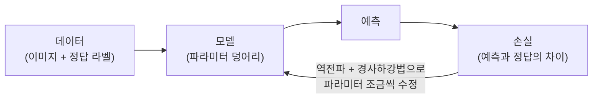
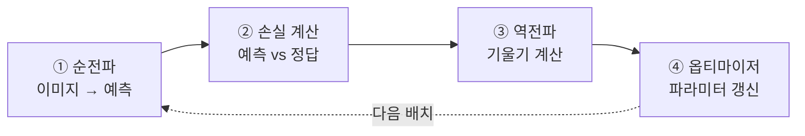

# ch1 개념 사전 — 프로젝트에 꼭 필요한 용어 한 번에 정리

> 강의 영상을 다 보지 않아도 exp01 코드를 읽고 돌릴 수 있도록, ch1에서 등장하는
> 용어를 **파이프라인 순서대로** 정리했다. 각 항목은 ①한 줄 정의 ②비유/부연
> ③우리 코드 어디에 나오는지 순서.

## 큰 그림 먼저



딥러닝 학습은 결국 이 루프 하나다: **예측하고 → 틀린 만큼 재고 → 덜 틀리는
방향으로 파라미터를 조금 고치고 → 반복**. 아래 용어들은 전부 이 그림의 어느
한 부분에 대한 이름이다.

### 머신러닝 / 딥러닝

- 머신러닝: 규칙을 사람이 코딩하는 대신, **데이터에서 규칙을 찾게** 하는 방법.
- 딥러닝: 그 규칙을 **여러 층을 쌓은 신경망**으로 표현하는 머신러닝의 한 갈래.
- 우리 프로젝트: "낚시하는 사진의 특징은 이렇다"를 코딩하는 게 아니라,
  낚시 사진 100장을 보여주고 모델이 스스로 찾게 한다.

### 지도학습 (supervised learning)

- **정답(라벨)이 붙은 데이터**로 학습하는 방식. "이 사진 = 낚시" 쌍을 준다.
- 우리 프로젝트가 정확히 이것. `data/ImageSplits/`의 split 파일이
  "어떤 이미지가 어떤 행동인지"를 알려주는 정답지다.

### 분류 (classification)

- 입력을 **정해진 보기 중 하나로** 고르는 문제. 우리는 40개 행동 중 택1.
- 반대 개념: 회귀(regression) — 숫자를 직접 예측 (예: 집값). ch1에서는 안 씀.

### 모델 / 파라미터 (가중치 · 편향)

- 모델 = 입력을 받아 예측을 내놓는 **수식 덩어리**. 그 수식 안의 조절 가능한
  숫자들이 **파라미터**(parameter). 곱해지는 쪽이 가중치(weight),
  더해지는 쪽이 편향(bias).
- "학습한다" = 이 숫자들을 좋은 값으로 맞춰간다. ResNet18은 약 1,117만 개.
- 코드: [`src/train.py`](../../src/train.py)의 `build_model()`,
  학습 시작 시 출력되는 `학습 대상 파라미터: 20,520개 / 전체 11,197,032개`.

---

## 데이터 쪽 용어

### 데이터셋 / train·test 분리

- 데이터셋: (입력, 정답) 쌍의 모음. 우리는 Stanford 40 Actions 9,532장.
- **train set** (4,000장): 모델이 보고 배우는 문제집.
- **test set** (5,532장): 학습에 절대 안 쓰고, 실력 측정에만 쓰는 모의고사.
  문제집 점수(train_acc)는 "외웠는지"와 구분이 안 되므로,
  **처음 보는 문제**를 풀게 해야 진짜 실력이 보인다.
- 코드: [`src/dataset.py`](../../src/dataset.py)의 `Stanford40` 클래스.

### 텐서 (tensor)

- 딥러닝에서 쓰는 **다차원 숫자 배열**. 숫자 하나(0차원)부터 벡터(1차원),
  행렬(2차원), 그 이상까지 전부 텐서라 부른다.
- 이미지 한 장은 `(3, 224, 224)` 텐서 — RGB 채널 3 × 세로 224 × 가로 224개의 숫자.
- 확인: `python src/dataset.py` 를 실행하면 `샘플 텐서 크기: (3, 224, 224)` 출력.

### 전처리 / 정규화 (normalize)

- 이미지를 모델에 넣기 전에 크기 통일(224×224), 텐서 변환, **정규화**를 한다.
- 정규화 = 픽셀 값의 평균/표준편차를 맞춰주는 것. 사전학습 모델은
  ImageNet 통계로 정규화된 입력을 "보고 자랐기" 때문에 같은 통계를 써야 한다.
- 코드: [`src/dataset.py`](../../src/dataset.py)의 `IMAGENET_MEAN/STD`와
  `build_transform()`.

### 데이터 증강 (data augmentation)

- 원본 이미지를 **매번 조금씩 다르게 변형**(무작위 크롭, 좌우반전)해서
  4,000장을 사실상 더 많은 것처럼 쓰는 기법. 통째로 외우기(과적합)를 어렵게 만든다.
- train에만 적용하고 test는 항상 같은 변환(가운데 크롭)을 쓴다 —
  시험 문제가 매번 바뀌면 점수 비교가 안 되니까.
- 코드: `build_transform(train=True)`의 `RandomResizedCrop` + `RandomHorizontalFlip`.
- 관련 질문: [q02 — 왜 test_acc가 train_acc보다 높지?](q02-why-test-acc-higher.md)

### 배치 (batch) / DataLoader

- 배치: 이미지를 **한 번에 묶어서** 처리하는 단위. 우리는 32장씩.
  한 장씩 하면 GPU가 놀고, 전부 한 번에 하면 메모리가 터진다 — 그 중간.
- DataLoader: 데이터셋에서 배치를 섞어서(`shuffle=True`) 꺼내주는 PyTorch 도구.
- 코드: [`src/train.py`](../../src/train.py)의 `train_loader` / `test_loader`.

### 에폭 (epoch)

- **학습 데이터 전체를 한 바퀴** 도는 것. 4,000장 ÷ 배치 32 = 에폭당 125번 갱신.
- exp01은 10에폭 = 문제집을 10번 반복해서 푼 셈.

---

## 모델 쪽 용어

### 신경망 / 층 (layer)

- 신경망: "입력 숫자들에 가중치를 곱해 더하고, 비선형 함수를 통과시키는" 단위를
  **층층이 쌓은** 구조. 층이 깊을수록(deep) 복잡한 패턴을 표현할 수 있다.
- ResNet**18** = 학습되는 층이 18개라는 뜻 (합성곱 17 + fc 1).

### 활성화 함수 / ReLU

- 층과 층 사이에 끼우는 **비선형 함수**. 이게 없으면 층을 아무리 쌓아도
  수학적으로 한 층짜리와 같아진다 (선형 변환의 합성은 선형).
- ReLU = `max(0, x)`. 음수는 0으로, 양수는 그대로. 단순한데 잘 작동해서 표준이 됨.
- ResNet18 내부 곳곳에 들어 있다 (우리가 직접 쓸 일은 아직 없음).

### 합성곱 (convolution) / CNN

- 작은 필터(예: 3×3)를 이미지 위에 **슬라이딩하며** 곱하고 더하는 연산.
  "이 필터 모양의 패턴이 이 위치에 있나?"를 온 이미지에 대해 검사하는 것.
- 앞쪽 층은 선/모서리 같은 단순 패턴, 뒤로 갈수록 질감 → 부품 → 물체처럼
  점점 추상적인 패턴을 감지한다.
- CNN = 합성곱 층을 주로 쌓은 신경망. 이미지에 강한 이유는 "패턴은 위치가
  바뀌어도 같은 패턴"이라는 성질을 구조 자체에 넣었기 때문.

### 특징 벡터 (feature vector)

- 백본이 이미지 한 장을 요약한 **숫자 512개짜리 벡터**. "이 이미지에 어떤
  패턴들이 얼마나 있는지"의 요약본.
- 마지막 fc층은 이 512개만 보고 40클래스 점수를 낸다.

### 백본 / fc층

- **백본**(backbone): 특징을 뽑는 몸통 (ResNet18의 합성곱 17층).
- **fc층**(fully-connected): 특징 512개 → 클래스 점수 40개로 바꾸는 마지막 판단 층.
- 자세한 그림과 숫자: [q01 — 백본 얼림이 무슨 뜻?](q01-backbone-freeze.md)

### 사전학습 / 전이학습 / 파인튜닝

- **사전학습**(pre-training): 다른 큰 데이터(ImageNet 120만 장)로 미리 학습해둔 것.
- **전이학습**(transfer learning): 사전학습된 모델을 가져와 **내 문제에 맞게 조정**.
  "이미지 보는 법"은 빌려 쓰고 판단 부분만 새로 가르친다.
- **파인튜닝**(fine-tuning): 전이학습에서 가중치를 **미세 조정**하는 단계.
  exp01은 fc만, exp02는 전체를 파인튜닝.
- 코드: `resnet18(weights=ResNet18_Weights.IMAGENET1K_V1)` — weights 인자가
  사전학습 가중치를 불러오는 부분.

### 얼림 (freeze) / requires_grad

- 일부 파라미터를 **갱신 대상에서 제외**하는 것. PyTorch에서는
  `param.requires_grad = False`.
- 관련 질문: [q01](q01-backbone-freeze.md) — 왜 얼리는지, 몇 개가 남는지.

---

## 학습 과정 용어

한 배치가 처리되는 순서 그대로:



코드로는 [`train_one_epoch()`](../../src/train.py)의 다섯 줄이 정확히 이 순서다:

```python
optimizer.zero_grad()              # (이전 기울기 청소)
outputs = model(images)            # ① 순전파
loss = criterion(outputs, labels)  # ② 손실
loss.backward()                    # ③ 역전파
optimizer.step()                   # ④ 갱신
```

### 순전파 (forward)

- 입력을 모델에 통과시켜 **예측을 계산**하는 것. `model(images)` 한 줄.

### 손실 함수 (loss function) / 크로스 엔트로피

- 예측이 정답에서 **얼마나 틀렸는지를 숫자 하나로** 재는 함수. 학습의 목표는
  이 숫자를 낮추는 것.
- **CrossEntropyLoss**: 분류의 표준 손실. 모델이 정답 클래스에 준 확신이
  높을수록 0에 가깝고, 엉뚱한 클래스를 확신할수록 커진다.
  40클래스 찍기 수준이면 약 `ln(40) ≈ 3.7` — exp01 로그의 초기 loss가
  이 근처인 이유.

### 역전파 (backpropagation) / 기울기 (gradient)

- **기울기**: "이 파라미터를 조금 키우면 손실이 얼마나 변하나"라는 민감도.
  파라미터 개수만큼 전부 계산된다.
- **역전파**: 그 기울기를 출력층에서 입력층 방향으로(뒤로) 미분의 연쇄법칙으로
  효율적으로 계산하는 알고리즘. `loss.backward()` 한 줄이 전부 해준다.

### 경사하강법 (gradient descent) / 학습률 (learning rate)

- 경사하강법: 기울기의 **반대 방향**(손실이 줄어드는 방향)으로 파라미터를
  조금씩 이동. 안개 낀 산에서 발밑 경사만 보고 아래로 내려가기.
- **학습률**: 그 한 걸음의 크기. 너무 크면 골짜기를 지나쳐 튕기고,
  너무 작으면 하세월. exp01은 1e-3.
- 관련 질문: [q03 — 전체 파인튜닝은 왜 학습률을 낮추나?](q03-full-finetune-low-lr.md)

### 옵티마이저 (optimizer) / AdamW

- 기울기를 받아 파라미터를 **실제로 갱신하는 규칙**. 가장 단순한 게 SGD
  (기울기 × 학습률만큼 이동).
- **AdamW**: 파라미터마다 보폭을 자동 조절(적응형)하는 개량판. 요즘 기본 선택지.
  당장은 "똑똑한 경사하강법" 정도로 이해하면 충분.
- 코드: `torch.optim.AdamW(trainable, lr=args.lr)`.

---

## 평가 쪽 용어

### 정확도 (accuracy)

- 맞힌 개수 ÷ 전체 개수. `outputs.argmax(dim=1)` — 40개 점수 중 가장 큰
  클래스를 예측으로 삼아 정답과 비교한다.
- train_acc와 test_acc는 재는 조건이 달라서 직접 비교하면 함정이 있다 →
  [q02](q02-why-test-acc-higher.md).

### 과적합 (overfitting)

- 문제집(train)을 **통째로 외워서** 문제집 점수만 좋고 처음 보는 문제(test)는
  못 푸는 상태. 데이터가 적고 파라미터가 많을수록 잘 생긴다
  (4,000장 vs 1,117만 개 — 우리가 백본을 얼린 이유).
- 신호: train_acc는 오르는데 **test_loss가 오르기 시작**할 때.

### train / eval 모드

- `model.train()` / `model.eval()`: 배치정규화·드롭아웃처럼 학습 때와 평가 때
  **다르게 동작해야 하는 층**에게 지금이 언제인지 알려주는 스위치.
  평가 전 `eval()`을 빼먹으면 결과가 오락가락하는 흔한 버그가 된다.
- 짝꿍: `@torch.no_grad()` — 평가 때는 기울기가 필요 없으니 계산을 꺼서 절약.

### 체크포인트 (checkpoint)

- 학습 중 모델 파라미터를 **파일로 저장**해둔 것. 우리는 test_acc 최고 기록을
  갱신할 때마다 `checkpoints/<실험명>_best.pt`에 저장 — 마지막 에폭이 아니라
  **가장 좋았던 순간**의 모델을 남긴다.

---

## 다 읽었으면

- [notes.md](notes.md) — 이 용어들이 실제로 exp01에서 어떻게 하나로 꿰어지는지
- [q01](q01-backbone-freeze.md) → [q02](q02-why-test-acc-higher.md) → [q03](q03-full-finetune-low-lr.md) — 질문으로 복습
