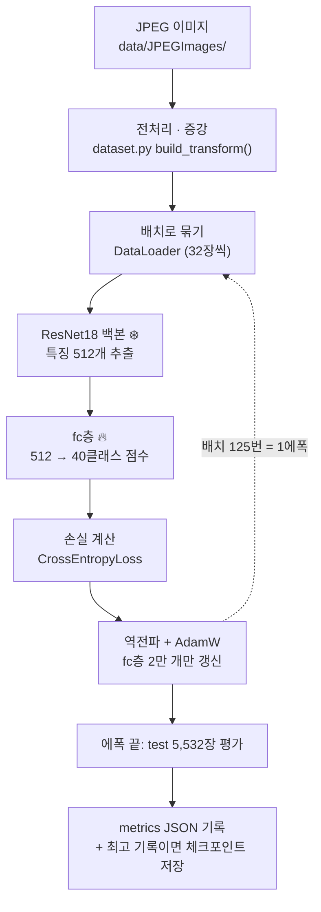

# ch1 학습 노트 — 이미지 한 장이 예측이 되기까지 (exp01 따라가기)

> [개념 사전](concepts.md)의 용어들이 실제 코드에서 어떻게 하나로 꿰어지는지,
> exp01(백본 얼린 전이학습 베이스라인)의 흐름을 처음부터 끝까지 따라간다.

## ch1에서 한 일 요약

| 항목 | 내용 |
|---|---|
| 문제 | 사진 속 사람 행동 40클래스 분류 (Stanford 40 Actions) |
| 데이터 | train 4,000장 (클래스당 100장) / test 5,532장 |
| 모델 | ImageNet 사전학습 ResNet18, 백본 얼리고 fc층만 교체·학습 |
| 학습 | AdamW, lr 1e-3, batch 32, 10에폭 (에폭당 ~18초, RTX 3050 Ti) |
| 결과 | **test acc 69.4%** — 학습한 건 전체 파라미터의 0.2%(2만 개)뿐 |
| 의미 | ImageNet에서 배운 특징이 우리 문제에도 통한다는 증거. exp02(전체 파인튜닝)의 비교 기준선 |

## 전체 흐름 한눈에



## 단계별로 따라가기

### 1. 데이터 준비 — [`src/dataset.py`](../../src/dataset.py)

`Stanford40` 클래스가 공식 split 파일을 읽어 (이미지 경로, 라벨 0~39) 목록을
만든다. 이미지를 실제로 여는 건 `__getitem__` 호출 순간 — 9,532장을 미리
전부 메모리에 올리지 않는다.

변환은 train/test가 다르다 (이게 [q02](q02-why-test-acc-higher.md)의 씨앗):

- train: `RandomResizedCrop(224)` + 좌우반전 — 매 에폭 조금씩 다른 이미지 (증강)
- test: `Resize(256)` + `CenterCrop(224)` — 항상 같은 결과 (공정한 채점)
- 둘 다 마지막에 ImageNet 평균/표준편차로 정규화 — 사전학습 모델이 기대하는 입력 분포

### 2. 모델 조립 — [`src/train.py`](../../src/train.py) `build_model()`

```python
model = resnet18(weights=ResNet18_Weights.IMAGENET1K_V1)  # 사전학습 가중치 로드
for param in model.parameters():
    param.requires_grad = False                            # 전부 얼림
model.fc = nn.Linear(model.fc.in_features, 40)             # 마지막 층만 새로 (얘만 학습됨)
```

세 줄에 전이학습 전략이 다 들어 있다: **보는 능력(백본)은 빌리고, 판단(fc)만
새로 가르친다.** 왜 이 전략인지는 [q01](q01-backbone-freeze.md).

### 3. 학습 루프 — `train_one_epoch()`

배치 하나마다 순전파 → 손실 → 역전파 → 갱신. 자세한 다섯 줄 해부는
[개념 사전의 학습 과정 섹션](concepts.md#학습-과정-용어) 참고.

exp01에서는 백본이 얼려 있어 실제로 움직이는 건 fc층 20,520개뿐 —
그래서 에폭당 18초로 빠르다 (역전파 계산량도, 갱신량도 적음).

### 4. 평가 — `evaluate()`

에폭이 끝날 때마다 test 5,532장 전체로 채점. 세 가지 안전장치에 주목:

- `model.eval()` — 배치정규화가 평가 모드로 동작
- `@torch.no_grad()` — 기울기 계산 끔 (평가에는 불필요, 메모리/시간 절약)
- test에는 증강 없음 — 매번 같은 조건으로 재야 에폭 간 비교가 됨

### 5. 기록 — `MetricsLogger` + 체크포인트

- 에폭마다 `docs/metrics/exp01_fc_only.json` 갱신 → `git push` 하면
  [대시보드](https://hakhyun-kim.github.io/deep-learning-study/)에 곡선이 뜬다.
- test_acc 최고 기록 갱신 시 `checkpoints/exp01_fc_only_best.pt` 저장.
  마지막 에폭이 아니라 **가장 좋았던 에폭**의 모델이 남는다.

## exp01 결과 읽기

```
[ 1/10] train_acc 0.251 | test_acc 0.546
[10/10] train_acc 0.639 | test_acc 0.692     ← 최고 69.4%
```

- 에폭 1부터 test 54.6% — 찍기(2.5%)의 20배. 학습 전에 이미 백본이 좋은
  특징을 뽑고 있었다는 뜻 (사전학습의 힘).
- test_acc가 train_acc보다 계속 높은 건 버그가 아니다 → [q02](q02-why-test-acc-higher.md)
- 후반부 상승이 완만해짐 — fc층만으로 짜낼 수 있는 성능의 한계 근처.
  더 올리려면 백본도 움직여야 한다 → exp02.

## 직접 해보기 (복습 겸)

```powershell
python src/train.py --smoke                          # 3분 안에 파이프라인 전체 확인
python src/dataset.py                                # 데이터셋/텐서 크기 확인
```

## 다음 챕터로 가는 질문

- exp02: 전체 파인튜닝으로 80%에 접근할 수 있나? 그때 학습률은 왜 낮추나 → [q03](q03-full-finetune-low-lr.md)
- 모델이 이미지의 **어디를 보고** 판단했나? → Grad-CAM 분석 (예정)
