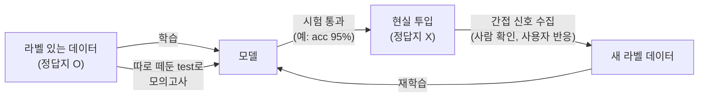

# Q5. 정답지 없는 현실 데이터에는 어떻게 적용하나?

> 2026-07-11 · [q04](q04-eval-loss-labels.md)에서 이어지는 질문

## 한 줄 답

기본 흐름은 맞다: **정답지 있는 데이터로 학습·시험 → 통과하면 정답지 없는
현실에 투입**. 단, 현실에서는 "시험 점수를 믿어도 되는 조건"이 있고,
투입 후에도 **간접 신호로 계속 채점하며 재학습**하는 순환 구조를 만든다.
한 번 배포하고 끝이 아니다.

## 기본 흐름

test set의 역할이 바로 "현실 리허설"이다. 모델에게는 처음 보는 데이터니까,
test 정확도는 **"현실에서도 대략 이 정도 맞히겠구나"의 추정치**다.

## 그 추정이 성립하는 조건 — 분포가 비슷할 것

test acc가 현실 성능을 대변하려면, **현실 데이터가 test 데이터와 닮아야** 한다.
닮지 않으면(카메라·조명·구도·유행이 다르면) 시험 점수보다 못한다.
이걸 **분포 변화(distribution shift / domain shift)**라고 한다.

우리 프로젝트로 예를 들면: exp01의 69.4%는 "Stanford40 스타일의 사진"에 대한
점수다. 내 폰으로 찍은 사진(셀카 구도, 한국 배경, 세로 사진)에 적용하면
그보다 낮게 나올 가능성이 높다 — 데이터가 다르게 생겼으니까.

시간이 지나면서 현실이 변하는 것도 같은 문제다 (새로운 유행, 새 기기,
계절 변화). 그래서 배포 후에도 감시가 필요하다.

## 정답지 없는 현실에서 실무가 쓰는 장치들

### 1. 확신도 기반 분기 (사람과 나눠 맡기)

모델의 softmax 확률을 "확신도"로 쓴다:

- 확신 높음 (예: 92%) → 자동 처리
- 확신 낮음 (예: 31%) → **사람에게 넘김** (human-in-the-loop)

의료 AI가 대표적: 확실한 정상만 자동 통과시키고 애매한 건 의사가 본다.
모델이 전부를 대체하는 게 아니라 **사람의 일을 줄이는** 구조.

### 2. 간접 신호를 정답으로 재활용

현실에는 명시적 정답지가 없어도 **정답을 알려주는 신호**가 흘러다닌다:

| 서비스 | 간접 신호 | 얻어지는 라벨 |
|---|---|---|
| 스팸 필터 | 사용자가 "스팸 신고" / "스팸 아님" 클릭 | 그 메일의 정답 |
| 사진 앱 얼굴 태그 | 사용자가 태그를 수정 | 수정 전 예측 = 오답, 수정 후 = 정답 |
| 추천 시스템 | 클릭했나, 끝까지 봤나 | 그 추천이 좋았는지 |
| 번역기 | 사용자가 번역문을 고침 | 더 나은 번역 |

이 신호를 모아 새 라벨 데이터를 만들고 주기적으로 재학습한다.
서비스가 잘 될수록 데이터가 쌓여 모델이 더 좋아지는 선순환
(**데이터 플라이휠**)이 실무 ML의 핵심 설계다.

### 3. 표본 채점 (배포 후 모의고사)

현실 입력 중 일부를 무작위로 뽑아 **사람이 직접 라벨링**해서 현실 정확도를
추정한다. 전수 채점은 불가능해도 표본 채점은 가능하다 — 여론조사와 같은 원리.

### 4. 감시 (모니터링)

정답 없이도 볼 수 있는 것들을 지켜본다:

- **입력 분포**: 들어오는 데이터가 학습 때와 달라지고 있나? (밝기, 크기, 단어 분포)
- **예측 분포**: 갑자기 특정 클래스만 잔뜩 예측하기 시작했나?
- **확신도 분포**: 평균 확신도가 떨어지고 있나? (분포 변화의 조기 신호)

이상이 감지되면 → 표본 채점으로 확인 → 새 데이터로 재학습.

## 요약

1. 정답지 있는 데이터로 학습하고, 떼어둔 test로 **현실 리허설** — 여기까지가 ch1에서 한 것
2. test 점수는 "현실 데이터가 test와 닮았다"는 조건에서만 현실 성능의 추정치
3. 배포 후에는 확신도 분기 · 간접 신호 수집 · 표본 채점 · 모니터링으로
   정답지 없이도 계속 채점하고, 모은 라벨로 **재학습하는 순환**을 만든다

## 확인 실험 아이디어

- 체크포인트(`checkpoints/exp01_fc_only_best.pt`)를 불러와 **내 폰 사진**을
  넣어보는 추론 스크립트 만들기 — top-5 클래스와 softmax 확신도 출력.
  Stanford40 스타일 사진과 내 일상 사진의 확신도 차이를 보면
  분포 변화를 몸으로 느낄 수 있다.

## 스스로 점검 (복습용)

- [ ] test 정확도가 현실 성능의 추정치가 되는 조건을 말할 수 있다
- [ ] 분포 변화(domain shift)가 뭔지 우리 프로젝트 예시로 설명할 수 있다
- [ ] 정답지 없는 현실에서 라벨을 얻는 방법을 두 가지 이상 말할 수 있다
