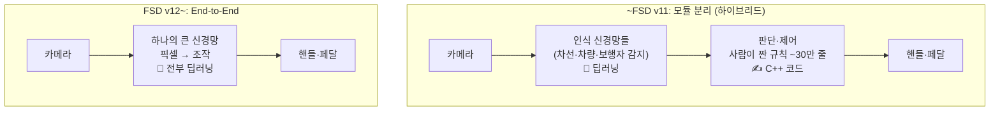

# Q6. 테슬라는 어떻게 룰베이스에서 E2E로 갔나?

> 2026-07-11 · [q05](q05-deploy-to-real-world.md)에서 이어지는 질문 — 현실 응용의 실제 사례

## 한 줄 답

"룰베이스 → 강화학습 → E2E"가 아니라 **"딥러닝 눈 + 사람 코드 뇌" → "전부 딥러닝"**
이 실제 진화다. E2E의 학습법은 강화학습이 아니라 주로 **모방학습** — 사람의 운전
자체가 정답지인 **지도학습**이고, 이건 우리 exp01과 같은 레시피의 초대형 버전이다.
그리고 사람의 개입이 채점이 된다는 직관은 정확하다.

## 진화 3단계

1. **하이브리드 시대 (~v11)**: "보는 것"은 이미 딥러닝이었다 (exp01 같은 CNN들의
   다중 작업 버전). 하지만 인식 결과를 받아 "어떻게 운전할지"는 사람이 짠
   규칙이었다 — "빨간불이면 정지선에 멈춘다" 류의 C++ 약 30만 줄.
2. **규칙의 한계**: 현실 운전의 예외 상황(공사, 수신호, 도로 위 낯선 물체)은
   끝이 없어서 규칙 추가로는 못 따라간다. 규칙끼리 충돌하고, 하나 고치면
   다른 게 깨진다.
3. **E2E (v12~, 2024년 배포)**: 판단까지 신경망에 흡수. "photons in, controls out" —
   판단 코드 30만 줄을 제거하고 데이터로 대체했다.

## E2E는 뭘로 배우나 — 모방학습 = 우리와 같은 지도학습

| | 우리 exp01 | 테슬라 E2E |
|---|---|---|
| 입력 | 사진 1장 | 주행 영상 (+ 차량 상태) |
| 정답 | 행동 라벨 (사람이 표기) | **그 순간 사람 운전자의 실제 조작** |
| 손실 | 예측 클래스 vs 정답 | 예측 조작 vs 사람의 조작 |
| 데이터 | 4,000장 | 수백만 대가 매일 만드는 (영상, 조작) 쌍 |

핵심 트릭: **운전은 라벨링이 공짜다.** 사람이 운전하는 것 자체가 정답을
기록하는 행위라서, 별도 라벨링 없이 세계 최대의 지도학습 데이터가 쌓인다.
실제로는 "운전 잘하는 사람"의 클립만 선별해 학습한다 — 나쁜 습관도 그대로
모방하기 때문 (데이터 품질 = 모델 품질).

강화학습(보상을 시행착오로 최적화)이 주역이 아닌 이유: 현실 도로에서
시행착오를 할 수 없고, 좋은 시범(사람 운전)이 무한히 있으면 모방이 훨씬 싸다.

## 사람의 개입 = 채점 (q05의 간접 신호, 실전판)

- **개입(disengagement)**: FSD 주행 중 사람이 핸들을 잡는 순간,
  "여기서 모델이 틀렸다"(오답 표시) + "사람은 이렇게 했다"(새 정답)가
  동시에 생긴다. 스팸 필터의 "스팸 신고" 클릭과 같은 구조.
- **섀도 모드(shadow mode)**: 사람이 운전하는 동안 모델이 몰래 "나라면
  이렇게 했을 것"을 예측 → 사람과 판단이 갈린 장면만 서버로 수집.
  배포 전에도 현실 데이터로 채점하는 장치.
- **데이터 엔진**: 모델이 약한 장면 수집 → 선별·라벨 → 재학습 → 배포 →
  다시 채점. q05의 데이터 플라이휠이 자동차 규모로 도는 것.
  테슬라의 경쟁력은 모델 구조보다 이 루프라는 평가가 많다.

## E2E로 가면서 잃은 것

- **설명 불가**: 규칙 30만 줄은 읽고 고칠 수 있지만, 신경망 가중치는 왜 그런
  판단을 했는지 읽을 수 없다. 특정 버그를 "그 줄만 고치기"가 불가능 —
  데이터를 바꿔 재학습하는 수밖에.
- **보장 불가**: "빨간불엔 반드시 선다"를 논리적으로 증명할 수 없다.
  검증이 코드 리뷰에서 **통계**(개입 없는 주행 마일 수)로 바뀐다 —
  규제·안전 논쟁의 핵심.
- 그래서 실무는 신경망 출력 뒤에 최소한의 안전 가드(속도 제한, 충돌 방지)를
  남겨두는 절충을 쓰기도 한다.

## 우리 프로젝트와의 연결

- exp01(이미지→클래스)과 테슬라 E2E(영상→조작)는 **같은 지도학습 레시피의
  크기 차이**다. 사전학습 백본 활용(전이학습)도 동일하게 쓰인다.
- q05의 "간접 신호로 계속 채점 → 재학습" 순환이 실제 산업에서 어떻게
  구현되는지의 최대 규모 사례.

## 스스로 점검 (복습용)

- [ ] v11까지의 구조에서 딥러닝이 맡은 부분과 사람 코드가 맡은 부분을 구분할 수 있다
- [ ] E2E의 정답지가 무엇인지, 왜 라벨링이 공짜인지 설명할 수 있다
- [ ] 개입(disengagement) 한 번에서 어떤 학습 신호 두 가지가 나오는지 안다
- [ ] E2E가 규칙 대비 잃는 것 두 가지를 말할 수 있다
