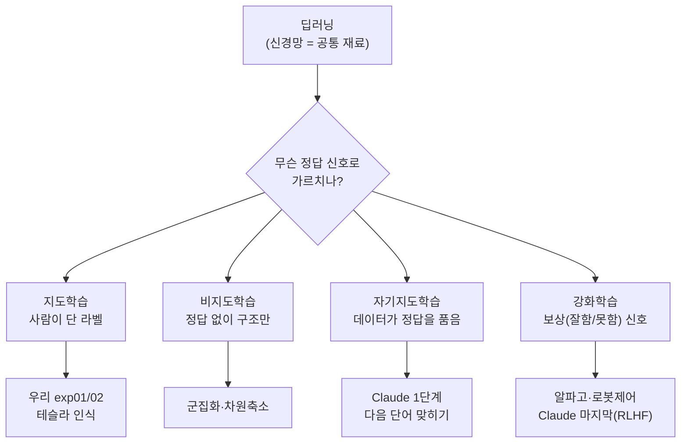
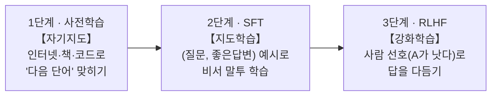

# q10 — 지도학습·자기지도·강화학습은 뭐가 다르고, Claude는 어떤 학습으로 만들어지나?

관련: [concepts.md 지도학습](concepts.md#지도학습-supervised-learning) ·
[q05 현실 적용](q05-deploy-to-real-world.md) · [q06 테슬라 E2E/모방학습](q06-tesla-rule-to-e2e.md) ·
[전이학습(exp02)](../ch2/concepts.md)

> "우리 프로젝트가 강화학습인가? LLM은 어떤 학습인가?"가 헷갈릴 때 보는 지도.
> **한 줄 요지: 딥러닝은 도구(신경망)일 뿐, "무슨 정답 신호로 가르치나"가 따로 있다.**

## 가장 큰 오해부터: "딥러닝"은 학습 방법이 아니다

딥러닝 = **신경망이라는 공통 재료**를 가리키는 말이다. 우리 ResNet18도, 테슬라도,
Claude도 전부 신경망 = 전부 딥러닝. 다른 건 그 신경망을 **어떤 정답 신호로
훈련하느냐** — 이게 **학습 패러다임**이고, 여기서 갈린다.

## 우리가 지금 하는 건? → 지도학습 (강화학습 아님)

exp01/exp02는 **지도학습(supervised)**. `"이 사진 = phoning"`처럼 **사람이 미리
정답(라벨)을 달아준** 데이터로 배운다 ([`dataset.py`](../../src/dataset.py)의
`ImageSplits` 파일이 그 정답지). 에이전트가 행동하고 보상받는 강화학습과는 무관.

## 학습 패러다임 4종 — 정답이 "어디서 오느냐"로 구분

| 패러다임 | 정답이 어디서 오나 | 예시 |
|---|---|---|
| **지도학습** | 사람이 라벨을 달아줌 | 우리 프로젝트, 테슬라 인식 |
| **비지도학습** | 정답 없이 데이터 구조만 찾기 | "비슷한 것끼리 묶어봐"(군집화) |
| **자기지도학습** | **데이터 자체가 정답을 품고 있음** | Claude 1단계(다음 단어 맞히기) |
| **강화학습(RL)** | 정답 대신 **보상(잘함/못함)** 신호 | 알파고, 로봇, Claude 마지막 단계 |

"지도학습이 아닌 학습"은 크게 둘:
- **자기지도학습**: 사람이 라벨을 안 달지만 **데이터 안에 이미 정답이 있음**. → LLM의 핵심.
- **강화학습**: 정답 대신 **점수만** 주고, 그 점수를 최대로 만드는 법을 스스로 터득.

## 테슬라는? → 지도학습 + 모방학습

- **인식**(카메라 → "이건 차, 이건 차선, 이건 보행자"): 사람이 픽셀에 라벨을 단
  **지도학습**.
- **E2E 주행**([q06](q06-tesla-rule-to-e2e.md)): "이 상황에서 사람 운전자가 핸들을
  이렇게 꺾었다"를 정답으로 삼는 **모방학습** — 정답이 사람의 행동일 뿐, 지도학습의 사촌.

## Claude / ChatGPT는? → 한 학습이 아니라 3단계 레시피

**1단계 — 사전학습 (자기지도학습).** 엄청난 텍스트를 모아 딱 하나 시킨다:
**"다음 단어 맞히기."**

> "고양이가 매트 위에 ___" → "앉았다"

정답 "앉았다"는 **원문에 이미 있다** — 사람이 라벨을 달 필요가 없다. 그래서
인터넷 전체가 공짜 문제집이 된다(자기지도학습의 결정적 트릭). 이 단계가 끝나면
문법·지식·추론을 익힌 "그럴듯한 다음 단어 예측기"지만, 아직 **친절한 비서는 아니다.**

**2단계 — 지도 파인튜닝 (SFT).** 사람이 `(좋은 질문, 좋은 답변)` 예시를 써줘서
"이렇게 답하는 게 비서다"를 가르친다. **우리 exp02와 똑같은 지도 파인튜닝.**

**3단계 — RLHF (여기서 드디어 강화학습).** 한 질문에 여러 답을 만들게 하고
**사람이 "A가 B보다 낫다" 순위**를 매긴다 → 그 선호를 예측하는 "보상 모델"을 만든 뒤
**강화학습**으로 사람이 더 좋아하는 답을 내도록 다듬는다. (Anthropic은 여기에 원칙
목록을 주고 AI가 스스로 피드백하는 *Constitutional AI*도 사용.)

➡ **"Claude는 강화학습이야?"의 정답**: 대부분은 자기지도학습(1단계)이고, **마지막
광택 단계에서만 강화학습**을 쓴다.

## 전부 한 장에 — 재료는 같고 정답 신호만 다르다

| 시스템 | 학습 패러다임 | 정답(신호)이 뭐냐 |
|---|---|---|
| 우리 ResNet (exp01/02) | 지도학습 | 사람 라벨 "이 사진 = phoning" |
| 테슬라 인식 | 지도학습 | 사람 라벨 "이 픽셀 = 차/차선" |
| 테슬라 E2E 주행 | 모방학습 | 사람 운전자의 행동 |
| **Claude 1단계 (본체)** | **자기지도학습** | 데이터 자체의 "다음 단어" |
| **Claude 마지막 단계** | **강화학습(RLHF)** | 사람 선호 "A > B" |

## 제일 중요한 연결 — exp02가 Claude 만드는 법의 축소판

> ImageNet으로 **사전학습된 백본**을 가져와(1단계) → 40클래스에 **파인튜닝**(2단계).
> Claude도 인터넷으로 **사전학습**(1단계) → 비서로 **파인튜닝**(2·3단계).

**"거대하게 사전학습하고 → 내 문제에 맞게 파인튜닝한다"**는 레시피가 완전히 같다.
규모(4천 장 vs 인터넷 전체)와 정답 신호(라벨 vs 다음 단어)만 다를 뿐,
우리가 [ch2](../ch2/concepts.md)에서 손으로 해 본 그 구조가 오늘날 LLM의 뼈대다.

## 한 줄 복습

- 딥러닝 = 재료(신경망). 지도/자기지도/강화 = **무슨 신호로 가르치나**.
- 우리 = 지도학습. 테슬라 = 지도학습+모방. Claude = 자기지도(본체)+지도(SFT)+강화(RLHF).
- 사전학습 → 파인튜닝 2단계는 우리 exp02나 Claude나 똑같다.
