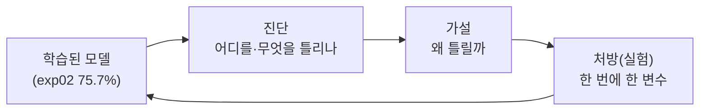

# ch3 개념 사전 — 분석과 개선에 필요한 용어

> ch1·ch2 개념을 안다고 가정하고, ch3에서 새로 만나는 것만 정리.
> ch3의 한 줄 요지: **"어디가 틀리는지 먼저 보고(진단), 거기에 맞는 처방을 한다."**
> exp02는 75.7%. 남은 4.3%p를 아무 기법이나 던져서가 아니라, **오답을 읽어서**
> 메꾼다.

## 큰 그림 — 진단 → 처방 루프

ch1·ch2가 "모델을 만들고 돌리는 법"이었다면 ch3는 **"돌린 모델을 뜯어보는 법"**이다.
테슬라도 새 FSD 빌드를 내보내기 전, 전체 성공률 하나만 보지 않고 "어떤 상황에서
개입(disengagement)이 나는지"를 유형별로 분해해서 본다 — 좌회전인지, 야간인지,
공사구간인지. 우리의 진단이 정확히 그 작업이다.

---

## 진단 쪽 용어

### 클래스별 정확도 (per-class accuracy)

- 전체 정확도 하나(75.7%)는 **평균**이라 어디가 새는지 안 보인다. 40개 클래스
  각각의 정확도를 따로 재면 잘하는 것과 못하는 것이 갈린다.
- 우리 실측(exp02): 강한 쪽 riding_a_horse 95.4%, climbing 92.3% vs
  약한 쪽 phoning 39.0%, waving_hands 40.0%, texting_message 40.9%.
  **56%p 격차** — "75.7%"라는 한 숫자가 가리고 있던 진짜 지형이다.
- 코드: [`scripts/analyze_errors.py`](../../scripts/analyze_errors.py).

### 클래스 불균형 (class imbalance)

- 클래스마다 데이터 수가 다른 것. train은 클래스당 100장으로 균등하지만,
  **test는 85장(rowing_a_boat)~196장(riding_a_horse)으로 제각각**이다.
- 그래서 전체 정확도는 데이터 많은 클래스에 유리하게 기운다. 클래스별로 봐야
  공정하다. (우리 목표 지표는 전체 정확도라 그대로 쓰지만, 분석은 클래스별로.)

### 혼동행렬 (confusion matrix)

- "정답이 A인데 B로 예측한 횟수"를 40×40 표로 적은 것. 대각선이 맞힌 것,
  나머지가 **무엇을 무엇으로 착각했나**이다.
- 우리 실측 상위 혼동 쌍: `writing_on_a_book → reading`(22회),
  `cooking → washing_dishes`(19회), `phoning → smoking`(18회),
  `drinking → brushing_teeth`(17회). — 헷갈리는 짝이 **의미상 비슷한**
  행동끼리라는 게 핵심 (아래 shortcut/fine-grained로 이어짐).
- 비유: 시험 채점 후 "3번을 4번으로 자주 틀렸네"를 표로 만든 오답노트.

### Grad-CAM (열지도로 근거 보기)

- 모델이 그 예측을 **이미지의 어디를 보고** 했는지 빨강(중요)~파랑(무관)
  열지도로 그리는 기법. 정확도가 "몇 점"이라면 Grad-CAM은 "왜 그렇게 찍었나".
- 원리(한 줄): 마지막 합성곱 블록(ResNet18의 `layer4`)이 내놓은 특징지도
  7×7×512에 대해, "이 클래스 점수를 올리는 데 각 채널이 기여한 정도"(기울기)를
  가중치로 곱해 더한다 → 근거가 있던 위치가 밝게 나온다. 그걸 224로 키워 원본에 겹침.
- 코드: [`scripts/gradcam.py`](../../scripts/gradcam.py) (결과는 `runs/gradcam/`).
- **테슬라 예시**: FSD가 "왜 갑자기 브레이크를 밟았나"를 볼 때, 그 순간 인식
  네트워크가 화면 어디에 반응했는지 히트맵으로 확인하는 것과 같은 도구다.
  숫자(개입률)만 보면 못 고친다 — 무엇을 보고 반응했는지를 봐야 원인이 잡힌다.

### 지름길 학습 / 거짓 상관 (shortcut learning / spurious correlation)

- 모델이 **문제의 본질(행동) 대신, 그와 우연히 같이 나오는 쉬운 단서(배경)**로
  정답을 맞히는 것. 학습 데이터에선 잘 맞지만 그 상관이 깨지는 순간 무너진다.
- **우리 실측 — Grad-CAM이 잡아낸 3대 사례** (전부 확신 98~100%로 오답):
  | 파일 | 정답 → 예측 | 모델이 실제로 본 곳 |
  |---|---|---|
  | phoning_253 | phoning → writing_on_a_board (99%) | 뒤 **벽의 글씨**(전화기 아님) |
  | reading_076 | reading → writing_on_a_board (100%) | 뒤 **칠판의 글씨**(책 아님) |
  | watching_TV_017 | watching_TV → cooking (98%) | 앞 **음식 접시들**(TV 아님) |
- 공통 진단: **exp02는 행동 인식기가 아니라 장면/맥락 인식기에 가깝다.**
  "글씨 있는 판 = writing_on_a_board", "접시 많음 = cooking"이라는 지름길을
  학습했다. 사람의 실제 동작은 뒷전.
- **테슬라 예시**: 초기 자율주행이 "차선은 흰 선"이라는 지름길을 배우면 눈 덮인
  길·공사장 임시선에서 무너진다. 또는 "이 카메라 얼룩이 항상 같이 보이니 무시"처럼
  데이터의 우연한 상관을 규칙으로 오해하는 것. **분포가 바뀌면 지름길은 끊긴다** —
  그래서 다양한 환경 데이터로 지름길을 못 쓰게 막는다(→ 증강).

### 미세 분류 (fine-grained classification)

- 큰 차이가 아니라 **작은 차이로 갈리는** 분류. 우리 약한 클래스 다수가 이 유형:
  phoning·smoking·drinking·texting은 전부 "손이 얼굴 근처" 포즈가 똑같고,
  **손에 든 작은 물건**(폰/담배/컵/칫솔)만 다르다.
- 혼동 쌍이 증명: `phoning → smoking`(18), `drinking → brushing_teeth`(17),
  `smoking → drinking`(14). 224×224로 줄이면 그 작은 물건이 몇 픽셀이라
  구분이 어렵다 — 이건 증강·스케줄러로는 잘 안 풀리는, 해상도·데이터의 문제.
- 진단의 정직함: **모든 오답이 "더 학습하면" 풀리지 않는다.** 어떤 건 지름길
  문제, 어떤 건 미세분류 문제 — 처방이 다르다.

---

## 개선(처방) 쪽 용어 — 우리가 가진 지렛대

> 원칙은 ch2 그대로: **한 번에 한 변수만**([ch2 concepts](../ch2/concepts.md#통제-실험--한-번에-한-변수만)).
> 아래는 후보 메뉴이고, exp03에서 하나만 고른다.

### 데이터 증강 강화 (stronger augmentation)

- 지금 우리 증강은 `RandomResizedCrop` + `RandomHorizontalFlip` 둘뿐
  ([`dataset.py`](../../src/dataset.py) `build_transform`). 더 얹을 수 있는 것:
  - **ColorJitter**: 밝기·대비·채도를 무작위로 흔듦. 색/조명에 기대는 지름길을 깬다.
  - **RandomErasing**: 이미지 일부를 무작위로 지움. **배경 한 조각을 가려서**
    모델이 배경 지름길에 덜 기대게 만든다 — 우리 shortcut 진단에 정확히 대응.
  - **RandAugment**: 여러 증강을 무작위 조합하는 자동 레시피(강력하지만 과할 수도).
- **테슬라 예시**: 같은 도로를 비·안개·역광·야간으로 증강해 보여주면, 모델이
  "맑은 날 그림자 모양" 같은 지름길을 못 쓰게 된다. 증강 = 지름길 차단기.
- 주의: 증강이 세지면 학습이 느려지고 수렴이 늦어진다 — 에폭을 늘려야 할 수도.

### 학습률 스케줄러 (lr scheduler) — cosine annealing

- 학습 도중 lr을 점점 줄이는 장치(ch2 개념 재등장). 초반 성큼 → 골짜기 근처 잰걸음.
- exp02는 고정 1e-4였는데, **ch2에서 test_loss가 10에폭까지도 계속 내려갔다** —
  "덜 수렴했다, 더 갈 여지가 있다"는 신호. cosine으로 20에폭 돌리면 마지막
  수렴이 더 좋아질 후보. 코드: `torch.optim.lr_scheduler.CosineAnnealingLR`.

### 조기 종료 (early stopping)

- test_loss가 오르기 시작하면(과적합 신호) 거기서 멈추고 best 체크포인트를 쓰는 것.
- 우리는 이미 **best만 저장**([`train.py`](../../src/train.py) 145줄)하므로 사실상
  "사후 조기종료"를 하는 셈. 에폭을 늘려도 best는 안전하다.

### 테스트 시각 증강 (TTA, test-time augmentation)

- 추론할 때 원본 + 좌우반전 등 여러 버전을 넣고 **예측을 평균**내는 것.
  학습은 그대로 두고 test 정확도만 공짜로 조금 올리는 기법. 마지막 짜내기 카드.

### 진단 없는 처방은 도박 (ch3의 메타 교훈)

- exp02b(lr 1e-3)에서 봤듯, 아무 값이나 바꾸면 20%p씩 날아간다. ch3의 규율:
  **오답을 먼저 읽고 → 그 오답을 줄일 법한 한 가지만 → 곡선/재진단으로 확인.**
- 우리 진단이 말해주는 처방 우선순위:
  1. 배경 지름길(writing_on_a_board 함정 등) → **RandomErasing/ColorJitter**가 직격.
  2. 덜 수렴 의심(test_loss 하락 지속) → **cosine + 에폭 증가**.
  3. 미세분류(손-물건) → 우리 지렛대로는 한계. 인정하고 기록해둔다.

## 다 읽었으면

- [notes.md](notes.md) — 위 개념으로 exp02를 실제 진단한 결과 + exp03 실험 설계
- [q09](q09-shortcut-learning.md) — 배경 보고 맞히면 정확도는 높은데 왜 문제일까?
