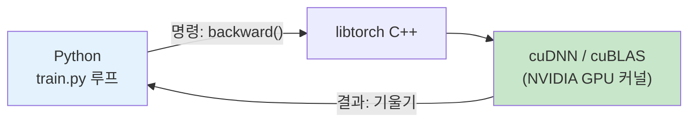

# q11 — PyTorch는 빠른가? 실무는 뭘 쓰나? 소스를 직접 고칠 수 있나?

관련: [`src/train.py`](../../src/train.py) (`loss.backward()` 74줄) ·
[q10 — Grad-CAM 원리](q10-gradcam-mechanism.md) · ch4(배포) 미리보기

## 무슨 질문인가

우리는 파이썬으로 PyTorch를 쓴다. 파이썬은 느리다고들 하는데 — **이 학습, 최적화가
잘 된 건가?** 실무에서도 이걸 쓰나, 아니면 더 빠른 게 따로 있나? 그리고 오픈소스라니
**내가 소스를 받아 고쳐가며 쓸 수 있나?**

## 1. PyTorch는 빠른가 — 파이썬은 지휘만 하고 계산은 C++/CUDA가 한다

핵심 오해 풀기: **우리가 만지는 건 파이썬이지만, 실제 계산은 파이썬이 하지 않는다.**
PyTorch는 두 겹이다.

| 겹 | 언어 | 하는 일 | 우리 코드에서 |
|---|---|---|---|
| 겉 | Python | "이 층 다음 저 층" 조립·지휘 | `train.py`의 for 루프 |
| 속 | C++ / CUDA | 행렬 곱·컨볼루션 같은 무거운 연산 | `loss.backward()` 안에서 일어남 |

[train.py:74](../../src/train.py)의 `loss.backward()` 한 줄을 부르면, 파이썬은
"역전파 시작해"라고 **명령만** 내린다. 실제 미분·행렬 연산은 `libtorch`(C++)와
cuDNN/cuBLAS(NVIDIA가 만든 GPU 라이브러리)가 GPU에서 돌린다. 파이썬의 느림이
끼어들 틈이 거의 없다.

> **테슬라 비유:** 자율주행차의 파이썬 코드는 "차선 유지 켜"라고 지시하는 **관제탑**,
> 실제 카메라 픽셀을 밀리초 단위로 처리하는 건 차에 박힌 **전용 칩(FSD 컴퓨터)**.
> 관제탑이 파이썬이라고 차가 느려지지 않는다. PyTorch도 똑같다.

**결론:** 초보 단계에서 "PyTorch가 느려서 손해"라는 걱정은 안 해도 된다.
우리 RTX 3050 Ti 4GB에서 병목은 PyTorch가 아니라 **GPU 메모리(4GB)와 데이터 로딩**이다
(그래서 [train.py:110](../../src/train.py)에서 `num_workers`, `pin_memory=True`로
데이터 공급을 챙긴다 — 여기가 진짜 튜닝 포인트).

## 2. 실무는 뭘 쓰나 — 학습은 PyTorch, 배포는 그 위에 도구를 얹는다

**연구·실무 모두 PyTorch가 사실상 표준.** 그리고 재밌게도 — **테슬라 자율주행팀이
PyTorch를 쓴다** (Andrej Karpathy가 테슬라 AI 총괄이던 시절 공개한 내용).

실무는 "학습"과 "배포"를 나눠 본다:

| 단계 | 무엇 | 도구 |
|---|---|---|
| **학습(training)** | 지금 우리가 하는 것 | **PyTorch** (JAX는 큰 연구소 소수) |
| **배포(inference)** | 학습한 모델을 서비스에 올려 속도를 짜냄 | `torch.compile`, ONNX, TensorRT |

- **`torch.compile`** — 파이썬 모델을 그래프로 컴파일해 더 빠르게 (PyTorch 2.0~, 한 줄).
- **ONNX / TensorRT(NVIDIA)** — 모델을 배포 전용 포맷으로 변환·최적화.
- 테슬라처럼 자기 칩이 있으면 그 칩 전용으로 다시 컴파일.

즉 실무에서도 **우리가 배우는 PyTorch를 그대로 쓰고**, 배포 때 위 도구들을 *추가로*
얹는다. PyTorch를 버리고 다른 걸 배우는 게 아니다. → ch4(배포)에서 이어감.

## 3. 소스를 직접 고칠 수 있나 — 가능하지만, 고칠 곳은 대부분 파이썬 층

PyTorch는 오픈소스(BSD)라 **소스 빌드·수정이 완전히 가능**하다. 하지만 현실적으로:

**PyTorch 코어 소스 빌드는 지금 단계에 권하지 않는다.** CUDA 툴킷·C++ 컴파일러 세팅이
필요하고 빌드에 수십 분~몇 시간 걸리며, 입문 목표에서 얻을 이득이 거의 없다.
C++/CUDA 코어를 고치는 건 프레임워크 개발자의 일이지 모델 만드는 사람의 일이 아니다.

**대신 "고쳐가며 쓰고 싶다"는 욕구는 소스 빌드 없이 거의 다 충족된다:**

| 하고 싶은 것 | 코어 빌드? | 실제 방법 |
|---|---|---|
| 학습 루프·손실·데이터 증강 바꾸기 | ❌ | `src/` 파이썬 수정 (**지금 하는 것**) |
| 새 층/연산 만들기 | ❌ | `nn.Module` 상속, `autograd.Function` 커스텀 |
| 특정 연산을 GPU에서 직접 최적화 | ❌ | **C++/CUDA extension** — 코어는 안 건드리고 내 커널만 따로 컴파일해 끼움 |
| PyTorch 코어 버그 수정·기여 | ✅ | 소스 빌드 → 수정 → PR |

> **테슬라 비유:** 자율주행을 개선하려고 차의 OS 커널을 다시 컴파일하지 않는다.
> 대부분은 **모델과 데이터**(파이썬 층)를 바꿔 개선한다. 커널을 건드릴 땐 통째 재빌드가
> 아니라 **새 모듈을 끼우는** 방식이다.

**정리:** 우리가 지금 개선하고 싶은 건 거의 100% `src/` 안의 파이썬 코드다. 그건 이미
소스로 자유롭게 고치고 있는 셈. 코어 소스 빌드는 "언젠가 프레임워크에 기여하고 싶다"
수준이 됐을 때 다시 꺼내면 된다.

## 한 줄 요약

> 파이썬은 지휘, 계산은 C++/CUDA — 그래서 PyTorch는 이미 빠르다. 실무도 학습은
> PyTorch고 배포 때 `torch.compile`·TensorRT를 얹는다. 소스 수정은 대부분 `src/`
> 파이썬 층에서 끝나고, 코어 재빌드는 거의 쓸 일이 없다.
