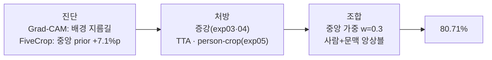

# ch4 노트 — 최종 결과, 재진단, 한계, 회고

## 최종 스코어보드 (전 실험)

| # | 실험/시스템 | 핵심 변화 (직전 대비 한 변수) | Test Acc |
|---|---|---|---|
| exp01 | fc만 학습 (백본 얼림) | — (베이스라인) | 69.4% |
| exp02 | 전체 파인튜닝 lr 1e-4 | 백본 해동 | 75.7% |
| exp02b | lr 1e-3 (통제 실험) | lr 10배 | 55.0% (붕괴) |
| exp03 | + ColorJitter/RandomErasing | 증강 | 75.05% |
| exp04 | + 에폭 20 | 학습 길이 | 75.80% |
| exp05 | + person-crop (margin 1.5) | 입력 시야 | 70.79% |
| — | exp04 + 5-crop TTA | 추론 방식 | 77.77% |
| — | **최종: 사람 0.3 + 전체 TTA 0.7** | 두-시야 앙상블 | **80.71%** 🎉 |

**최종 시스템 사양**: ResNet18 × 2 (exp04, exp05 체크포인트), 이미지당 순전파
6회, 확률 가중 평균(0.3/0.7). 재현:
`python scripts/two_view_ensemble.py --tta` (w=0.3 줄 확인).

## 최종 앙상블 재진단 (2026-07-15 실측)

### 약한 클래스 — 전부 개선됐지만, 남은 건 전부 미세분류

| 클래스 | exp04 | 최종 앙상블 | 변화 |
|---|---|---|---|
| phoning | 35.8% | 42.1% | +6.3%p |
| texting_message | 37.6% | 46.2% | +8.6%p |
| waving_hands | 38.2% | 50.0% | +11.8%p |
| taking_photos | 57.7% | 61.9% | +4.2%p |

하위 8개가 전부 **손-작은물건/손-포즈 계열**(phoning, texting, waving,
pouring, taking_photos, writing_on_a_book, drinking, smoking)이다. 혼동 1위도
`phoning → smoking` 31회. 강한 클래스는 95% 안팎(playing_violin 96.9%,
riding_a_bike 95.9%) — **남은 병목은 배경도 위치도 아니고 미세분류 하나다.**

### 지름길 3인방의 최후 — 오답의 "종류"가 바뀌었다

| 파일 | exp02 (시작) | 최종 앙상블 | 해석 |
|---|---|---|---|
| watching_TV_017 | cooking 98% (접시를 봄) | **✓ watching_TV 34%** | **정답 전환** |
| phoning_253 | writing_on_a_board 99% (벽 글씨) | ✗ smoking 41% | 지름길 사망 — 이제 **사람을 보고** 폰↔담배를 헷갈림(미세분류 오답으로 전환) |
| reading_076 | writing_on_a_board 100% | ✗ writing_on_a_board 95% | 유일한 생존 지름길 |

phoning_253이 상징적이다: "벽 글씨 → 필기"(배경 지름길, 99% 확신)에서
"손 근처 → 담배"(사람 기반 미세분류, 41% 확신)로 — **오답이지만 옳은 곳을 보고
틀리는 오답**이 됐다. ch3의 목표("행동 인식기로 만들기")가 숫자 밖에서도
달성됐다는 증거.

## 한계 (정직한 기록)

모델 카드([concepts](concepts.md#모델-카드-model-cards--한계를-문서화하는-관행)) 정신으로:

1. **미세분류 병목 잔존**: 하위 8개 클래스 전부 손-물건 구분 문제. 224×224
   해상도와 클래스당 100장으로는 폰/담배/컵의 픽셀 차이가 부족 — 우리 지렛대
   (증강·에폭·시야)로 안 풀렸고, 고해상도 입력이나 데이터 추가가 필요하다.
2. **지름길 일부 생존**: reading_076의 칠판 지름길은 person-crop 앙상블로도
   95% 확신 오답. 배경 단서가 사람 시야 crop 안까지 들어오는 경우는 못 막는다.
3. **bbox 주석 가정**: 80.71%는 공식 사람 bbox가 주어졌을 때의 숫자.
   실전 배포면 사람 탐지기가 앞단에 필요하고, 그 오류율만큼 깎인다.
4. **가중치의 test 선택**: 앙상블 w를 test 성적으로 골랐다(w=0.2~0.4 전 구간이
   80%를 넘어 결론은 강건하지만, 소수점은 낙관 편향). 엄밀한 재현이라면
   validation split에서 w를 고르고 test는 한 번만.
5. **추론 비용 6배**: 순전파 6회/장. 배치 처리엔 무관, 실시간엔 부적합.

## 회고 — 점수를 만든 것은 무엇이었나

- **진단 없는 처방은 한 번도 이기지 못했다** (exp02b −20%p가 그 증거).
  점수를 올린 모든 수는 측정(지름길, +7.1%p 격차, 상보성)에서 나왔다.
- **결정적 두 수는 학습자의 질문에서 나왔다**: "중앙을 더 믿으면?"(→ w 스윕
  77.98%), "사람 + 가운데 정보를 섞으면?"(→ 두-시야 앙상블 80.71%).
  질문 중심 학습이 커리큘럼 밖의 점수를 만든 사례.
- **실패는 재료였다**: exp05 단독 70.79%는 "실패"였지만, 다른 관점이라는
  이유만으로 앙상블에서 +3.6%p를 만들었다. 단독 점수로 모델을 버리지 말 것.
- 남은 미세분류는 이 구성으로는 끝까지 안 풀렸다 — 한계 인정도 결과다.

## 학습자 회고 (직접 채우기)

> 이 프로젝트에서 가장 예상과 달랐던 결과는? 가장 오래 기억할 교훈 하나는?

_(여기에 한 단락)_
