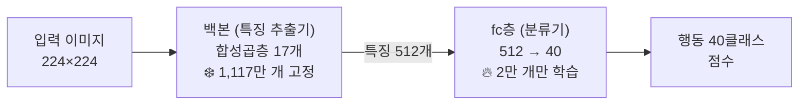

# Q1. 백본 얼림(freeze)이 무슨 뜻?

> 2026-07-11 · 관련: exp01_fc_only, [`src/train.py`](../src/train.py)의 `build_model()`

## 한 줄 답

학습 중에 백본(합성곱층)의 가중치를 갱신하지 않도록 잠그고, 마지막 fc층만 학습하는 것.

## ResNet18의 두 부분



- **백본** = 합성곱층 17개. "여기 선이 있다, 털 질감이다, 사람 팔 모양이다" 같은 특징을 뽑아
  이미지를 숫자 512개(특징 벡터)로 요약하는 부분.
- **fc층** = 마지막 1개 층. 특징 512개를 보고 40개 클래스 점수로 판단하는 부분.
- 17 + 1 = 18이라서 ResNet"18".

## 코드로는

```python
model = resnet18(weights=ResNet18_Weights.IMAGENET1K_V1)
for param in model.parameters():
    param.requires_grad = False        # 얼림: 역전파 때 기울기 계산/갱신 안 함
model.fc = nn.Linear(512, 40)          # 새 층은 기본 requires_grad=True → 이것만 학습됨
```

`requires_grad=False`면 역전파 때 그 파라미터의 기울기를 계산하지 않아서
가중치가 학습 내내 처음 값(ImageNet 사전학습 값) 그대로 유지된다.

## 숫자로 확인 (exp01 로그)

```
학습 대상 파라미터: 20,520개 / 전체 11,197,032개
```

20,520 = 512×40 (가중치) + 40 (편향) — 정확히 fc층 하나 분량. 전체의 0.2%.

## 왜 얼리나?

백본은 이미 ImageNet 120만 장으로 "이미지 보는 법"을 배워둔 상태.
우리 학습 데이터는 4,000장뿐이라 1,117만 개를 전부 다시 학습하면:

1. 데이터가 부족해서 **과적합**되기 쉽고
2. 잘 배워둔 특징을 **망가뜨릴** 수 있다

그래서 첫 실험은 "보는 능력은 빌려 쓰고, 판단 부분만 새로 가르치자" 전략.
이것만으로 test acc 69.4% → ImageNet 특징이 우리 문제에도 꽤 잘 통한다는 증거.

## 이어지는 질문

- fc층만으로는 69% 근처가 한계 → 백본까지 미세조정하면? → exp02 (전체 파인튜닝)
- 그때 왜 학습률을 낮추나? → [q03](q03-full-finetune-low-lr.md)

## 스스로 점검 (복습용)

- [ ] 백본과 fc층이 각각 무슨 역할인지 설명할 수 있다
- [ ] `requires_grad=False`가 역전파에서 무엇을 막는지 안다
- [ ] 20,520이라는 숫자가 어떻게 나오는지 계산할 수 있다
- [ ] 데이터가 적을 때 전체를 학습하면 생기는 문제 2가지를 말할 수 있다
